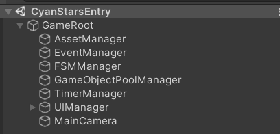
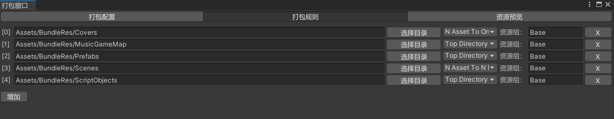
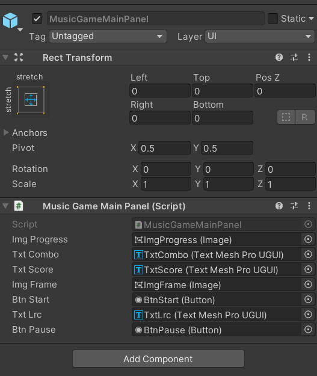
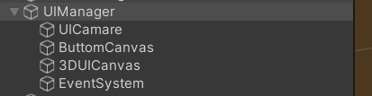

# 前言

此手册建议配合项目代码查阅


# 入口场景

游戏的入口场景为`Assets/CyanStarsEntry.unity`，其中包含**GameRoot**节点与其下各类**Manager**子节点，此场景为运行时常驻场景



（注意：在构建安装包时固定**只会包含此入口场景**，其他场景统一通过`AssetManager`进行加载）


# GameRoot（游戏根节点）

游戏入口脚本，继承`Monobehaviour`


管理所有**Manager**与**DataModule**，并持有管理游戏整体生命周期的**Procedure**


会在`Start`时为已声明的Manager静态属性赋值，并初始化所有**DataModule**


## Procedure（流程）

框架使用**Procedure（流程）**来管理游戏整体生命周期的运转，其本质是一个**FSM（状态机）**，因此游戏运行中每个时刻都**处于且只能处于一个Procedure中**


通常来说，会将相对独立的游戏过程抽象为一个**Procedure**，如`MainHomeProcedure（主界面流程）`，`MuicGameProcedure（音游流程）`


（注意：入口流程固定为`StartupProcedure`，相关初始化工作应在此流程中完成后再切换到后续流程）


# BaseManager（管理器基类）

框架管理器基类，继承`Monobehaviour`，派生出各类**Manager**


实现出的各类**Manager**需统一挂载到**GameRoot**下作为其子节点存在，并在`GameRoot`类中增加对应静态属性方便上层调用


会在`Awake`时将自身注册到`GameRoot`中


# BaseDataModule（数据模块基类）

数据模块基类，派生出各类**DataModule**


**DataModule**主要用于存储**Procedure**运行中产生的运行时数据，并提供不同**Procedure**间进行跨流程数据交互的功能


如`MusicGameModule`便负责存储音游相关的数据


# AssetManager（资源管理器）

游戏中所有资源的管理都通过`AssetManager`进行，对应的静态属性为`GameRoot.Asset`


## 资源加载

所有加载都是**异步**进行的


非场景资源的加载方式为`GameRoot.Asset.LoadAsset(string assetName, Action<bool, Object> loadedCallback)`


场景资源的加载方式为`GameRoot.Asset.LoadScene(string sceneName, Action<bool, Object> loadedCallback)`


需要的`assetName`与`sceneName`为资源全路径，即**Asset/xxxx/yyy.zzz**形式（可通过**右键点击某个资源-Copy Path**将此路径复制到粘贴板）


## 资源卸载

在加载资源后，若不需要此资源需要调用卸载接口，分别为`UnloadAsset`与`UnloadScene`


由于**资源的加载与卸载调用必须成对出现**，为了降低漏卸载的可能性， `AssetManager`提供了将资源与**GameObject**生命周期绑定的方式，其使用方式为`bindingTarget.GetOrAddComponent<AssetBinder>().BindTo(asset)`，可在`bindingTarget`被销毁时卸载与其绑定的资源

## async/await扩展

考虑到异步回调与手动绑定的不便性，`AssetManager`提供了基于`async/await`的调用方式：

`T asset = await GameRoot.Asset.AwaitLoadAsset<T>(string assetName,GameObject bindingTarget)`


使用此方式只需要将资源路径与需要绑定的**GameObject**传入即可

**（建议使用此方式）**


## 资源配置

项目中所有需要通过`AssetManager`加载的资源都放在**Asset/BundleRes**目录下


在此目录下创建对应资源目录，然后**右键点击目录-添加为打包规则目录**即可将新建的资源目录纳入资源包构建范围内


目前提供了3种**基于资源目录的资源包构建规则**：

1. **N Asset To One Bundle**（将资源目录下所有资源合并构建为一个资源包）

2. **Top Dicrectory N Asset To One Bundle**（对资源目录下所有一级目录应用N Asset To One Bundle）

3. **N Asset To N Bundle**（将资源目录下所有资源各自构建为一个资源包）

   

可通过点击编辑器上方导航栏的**CatAsset/打开打包窗口**打开**打包窗口**，然后点击**打包规则**分页为新添加的资源目录配置构建规则



**（建议：尽量将生命周期接近的资源构建为一个资源包）**


## 安装包构建

可通过点击编辑器上方导航栏的**CyanStars工具箱/构建安装包**进行对应平台的安装包构建，最终构建出的安装包会输出到**CyanStars\Cyan-Stars\BuildPlayer**的对应平台部目录下


# EventManager（事件管理器）

`EventManager`负责事件的监听与派发，对应的静态属性为`GameRoot.Event`


## 事件的监听与派发

监听：`GameRoot.AddListener(string eventName, EventHandler<EventArgs> handler)`

派发：`GameRoot.Dispatch<T>(string eventName, object sender, T eventArgs)`

移除监听：`GameRoot.RemoveListener(string eventName, EventHandler<EventArgs> handler)`


（注意，**对于事件的监听与移除监听需要是成对调用的**，如`OnOpen`时监听，`OnClose`时移除，以免忘记移除监听导致对象无法被释放）


## 事件的定义

### 包含参数的事件

此类事件需要创建对应的事件参数类，并实现`EventArg`s与`IReference`


然后在其中定义表示事件名的常量字符串`public const string EventName = nameof(事件参数类)`


最后实现一个静态的`Create`方法与`Clear`方法，前者将此事件参数类的实例从引用池中获取出来，后者则是重置了此事件参数类的各参数值


示例：

```csharp
    /// <summary>
    /// 输入事件
    /// </summary>
    public class InputEventArgs : EventArgs,IReference
    {
        public const string EventName = nameof(InputEventArgs);

        /// <summary>
        /// 输入类型
        /// </summary>
        public InputType Type { get; private set; }

        /// <summary>
        /// 输入编号
        /// </summary>
        public int ID { get; private set; }

        /// <summary>
        /// 输入范围最小值
        /// </summary>
        public float RangeMin { get; private set; }

        /// <summary>
        /// 输入范围宽度
        /// </summary>
        public float RangeWidth { get; private set; }


        public static InputEventArgs Create(InputType type,int id,float rangeMin,float rangeWidth)
        {
            InputEventArgs eventArgs = ReferencePool.Get<InputEventArgs>();
            eventArgs.Type = type;
            eventArgs.ID = id;
            eventArgs.RangeMin = rangeMin;
            eventArgs.RangeWidth = rangeWidth;

            return eventArgs;
        }

        public void Clear()
        {
            Type = default;
            ID = default;
            RangeMin = default;
            RangeWidth = default;
        }
    }
```


### 空事件

对于没有参数的空事件而言，只需要单独定义其事件名常量字符串，然后使用`EventManager`提供的`EmptyEventArgs`作为事件参数对象即可

如：`GameRoot.Event.Dispatch(EventConst.MusicGameStartEvent, this, EmptyEventArgs.Create())`


# FSMManager（状态机管理器）

`FSMManager`管理游戏中所有**状态机**，对应的静态属性为`GameRoot.FSM`


## BaseState（状态基类）

`FSM`中的**State**类需要从此基类中派生


## FSM操作

创建FSM：`Fsm fsm = GameRoot.FSM.CreateFSM(List<BaseState> states)`

切换State：`fsm.ChangeState<T>() where T : BaseState` 


（注意，在创建状态机后需要手动切换**State**才能让`FSM`进入第一个**State**）


## ProcedureStateAttribute（流程状态特性）

此特性标记了所有被视为**Procedure**的**State**，**Procedure**在游戏开始时会被`GameRoot`自动收集并用来初始化`ProcedureFSM`


# GameObjectPoolManager（游戏对象池管理器）

`GameObjectPoolManager`提供了将**GameObject**对象池化的功能，对应的静态属性为`GameRoot.GameObjectPool`


## 获取GameObject

`GameObjectPoolManager`提供了基于资源路径与基于模板物体这两种方式来从池中获取**GameObject**


基于资源路径：`void GetGameObject(string prefabName, Transform parent, Action<GameObject> callback)`

基于模板物体：`void GetGameObject(GameObject template, Transform parent, Action<GameObject> callback)`


基于资源路径的获取方式，会由`GameObjectPoolManager`管理此资源的加载与卸载

基于模板物体的获取方式，通常传入的是作为物体子节点的item模板物体


由于`GetGameObject`的实现是异步的，所以也提供了对应的`async/await`扩展来方便使用


## 归还GameObject

`GameObjectPoolManager`同样提供了对应基于资源路径与基于模板物体两种方式将**GameObject**归还池中，其接口为`ReleaseGameObject`


# ReferencePool（引用池）

`ReferencePool`提供对C#类的对象池化管理，其接口都为静态方法，可直接调用


需要对象池化的C#类需要实现`IReference`才能被`ReferencePool`管理


获取引用：`T Get<T>() where T : IReference,new ()`

归还引用：`void Release(IReference reference)`


（目前事件参数类都通过`ReferencePool`实现了对象池化）


# TimerManager（定时器管理器）

`TimerManager`提供对于定时调用的功能，对应的静态属性为`GameRoot.Timer`


**Timer**分为两种：

1. 需要Update调用的，通过`void AddUpdateTimer(UpdateTimerCallback callback)`和`void RemoveUpdateTimer(UpdateTimerCallback callback)`进行添加与删除
2. 在指定时间后调用的，通过`void AddTimer(float delay,TimerCallback callback,int count)`和`void RemoveTimer(TimerCallback callback)`进行添加与删除（**count参数表示重复次数，若<=0则表示无限次**）


# UIManager（UI管理器）

`UIManager`提供对于**UIPanel**的管理，对应的静态属性为`GameRoot.UI`


（所有**UIPanel**和**UIItem**都受`GameObjectPoolManager`管理，所以需要开发者自行处理好UI数据重置工作）


## BaseUIPanel（UI面板基类）

派生自`MonoBehaviour`，所有UI面板类从此基类派生

`UIManager`的管理单位即是**UIPanel**




打开UI面板：`GameRoot.UI.OpenUIPanel`

关闭UI面板：`GameRoot.UI.CloseUIPanel`

（`OpenUIPanel`为异步方法，提供了**async/await**扩展）


**UIPanel**生命周期方法有：

1. `OnCreate`（此**UIPanel**的**GameObject**被实例化时调用）
2. `OnDestroy`（此**UIPanel**的**GameObject**被销毁时调用）
3. `OnOpen`（此**UIPanel**被打开时调用）
4. `OnClose`（此**UIPanel**被关闭时调用）

可以看出，1与2，3与4分别为成对的生命周期方法


### UIGroup（UI组）

`UIManager`通过**UIGroup**划分各组UIPanel，每个**UIGroup**都对应**GameRoot/UIManager**下的一个Canvas节点




主要作用在于为**UIPanel**进行层级管理，各组UIPanel的层级是分开计算的


### UIDataAttribute（UI面板数据特性）

此特性用于标记在**UIPanel**类上，用于记录此UIPanel的预制体资源路径，UI组名等信息

（**UIPanel**必须标记此特性才能进行打开或关闭）


## BaseUIItem（UIItem基类）

派生自`MonoBehaviour`，所有**UIItem**类从此基类派生

通常来说，像常见的背包格子，列表项，子页面这样依赖于某个**UIPanel**而存在的都属于UIItem范畴


获取UIItem：`GameRoot.UI.GetUIItem`

归还UIItem：`GameRoot.UI.ReleaseUIItem`

（`GetUIItem`为异步方法，提供了**async/await**扩展）


**UIItem**的生命周期方法有：

1. `OnCreate`（此**UIItem**的**GameObject**被实例化时调用）
2. `OnDestroy`（此**UIItem**的**GameObject**被销毁时调用）
3. `OnGet`（此**UIItem**被获取时调用）
4. `OnOnRelease`（此**UIItem**被归还时调用）


### IUIItemData（UIItem数据接口）

刷新**UIItem**所需要的数据类实现此接口，通常与**IReference**共同使用

